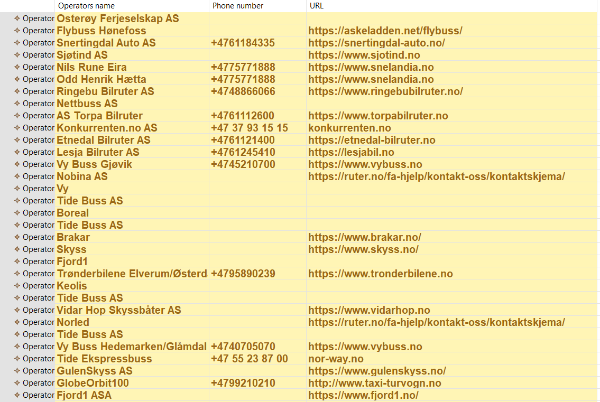
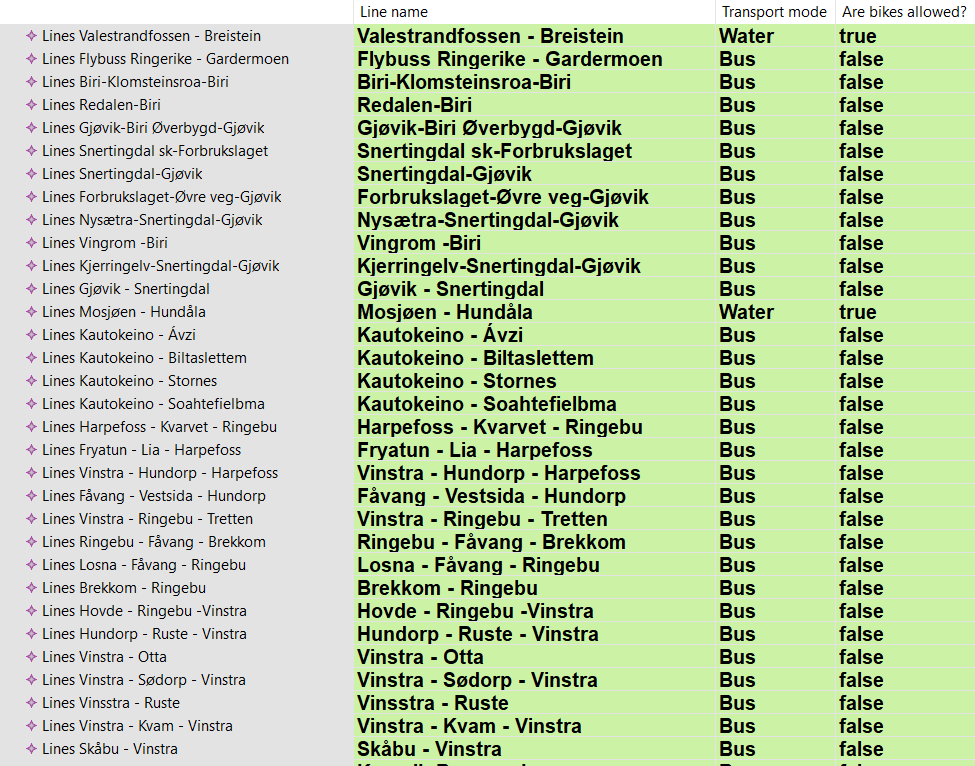
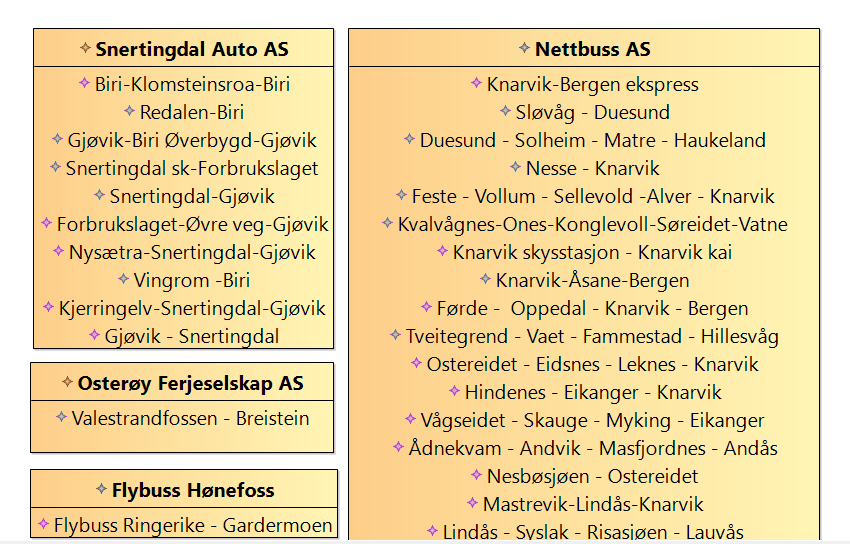
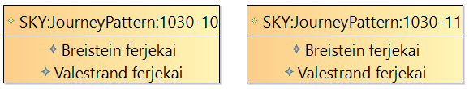

# Model Instance and Sirius Readme

### How to generate views in Sirius:
After cloning the repository to Eclipse:
1. Delete the XMI-file in the bundle modelInstance
2. Copy the XMI-file from the bundle pluginProject/src/data to the bundle modelInstance
3. Open the file representations.aird in the bundle modelInstance. Click add, browse workspace, and choose transportOrg under modelInstance
4. To generate views of OpLines Diagram, EnturLinesTable, og EnturOperatorsTable: Double click on the representation you want to view, choose the root-element in the XMI (Transport Org Entur), and click finish
5. To generate view of StopPlacesLinesDiagram: Double click on the representation, navigate through Transport Org Entur and the first Operator, and choose the element Lines. Click finish.

## Table: Operators information
Table of all operators and its attributes.

## Table: Line information
Table of all lines and its attributes.

## Diagram: Operators' lines
Diagram of all lines to all operators.

## Diagram: Routes' stop places
Diagram of all stop places to all routes for one specific line. Chose to model only a specific line and its routes to constrain the amount of data to process.

